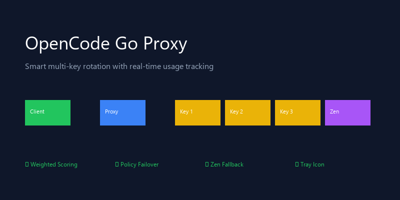
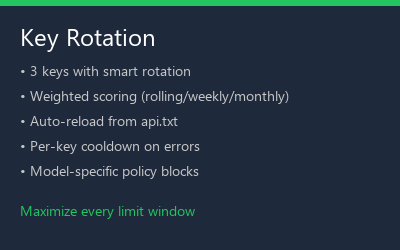
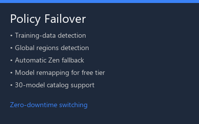
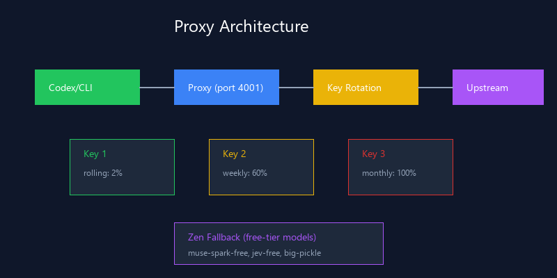

# OpenCode Go Proxy

Smart proxy for OpenCode Go API with multi-key rotation, weighted scoring, policy failover, Zen fallback, and system tray icon.

## Features

## Architecture

## Quick Start

1. Add keys to `F:\backup\windowsapps\credentials\opencodego\api.txt` (one per line)
2. Run `build.ps1` to compile
3. Run `start_proxy.ps1` to start

## Key Rotation

The proxy polls `/usage` every 20 seconds per key and computes a weighted score:

- **Rolling (5h window)**: 60% weight — tightest limit, dominates scoring
- **Weekly**: 25% weight — secondary constraint
- **Monthly**: 15% weight — longest window, hardest to reset

Keys are sorted by score (100 = fresh, 0 = exhausted) and the best key is always tried first. New keys added to `api.txt` are picked up instantly — no restart needed.

## Policy Failover

When the Go gateway rejects a request (training-data, Global regions, privacy opt-in), the proxy automatically retries on the next key. If all keys are exhausted, it falls back to the Zen free-tier endpoint with model remapping.

## Configuration

Edit `config.json`:

| Setting | Default | Description |
|---------|---------|-------------|
| `listen_prefix` | `http://127.0.0.1:4001/` | Proxy listen address |
| `upstream_base_url` | `https://opencode.ai/zen/go/v1` | Primary Go upstream |
| `zen_upstream_base_url` | `https://opencode.ai/zen/v1` | Zen fallback upstream |
| `credential_source` | `...\api.txt` | Key file path |
| `retry_http_statuses` | 401,402,403,408,425,429 | Retried HTTP statuses |

## System Tray

The proxy runs with a system tray icon showing real-time status:
- Green: All keys healthy
- Yellow: Some keys rate-limited
- Red: All keys exhausted (Zen fallback active)

## License

MIT
