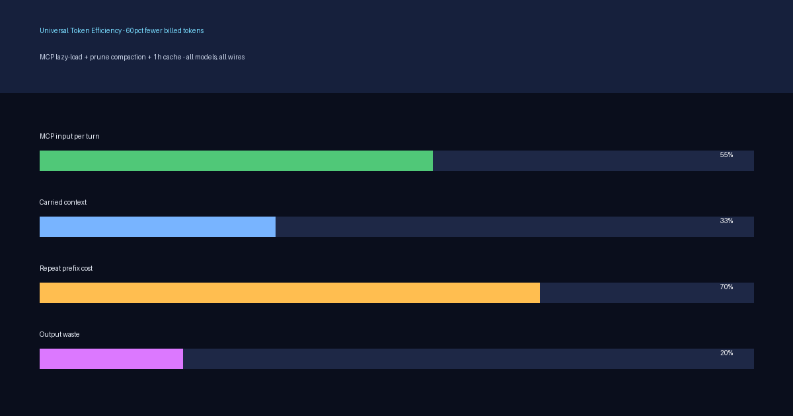
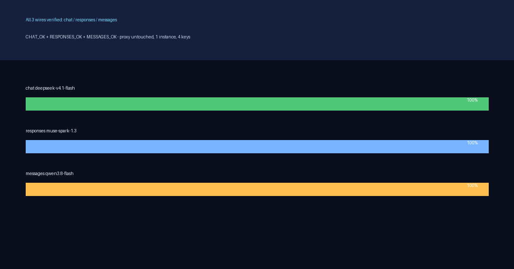
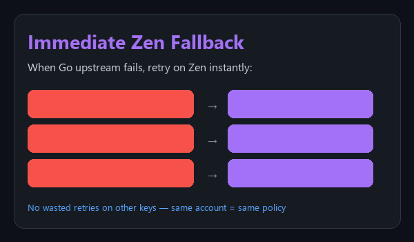
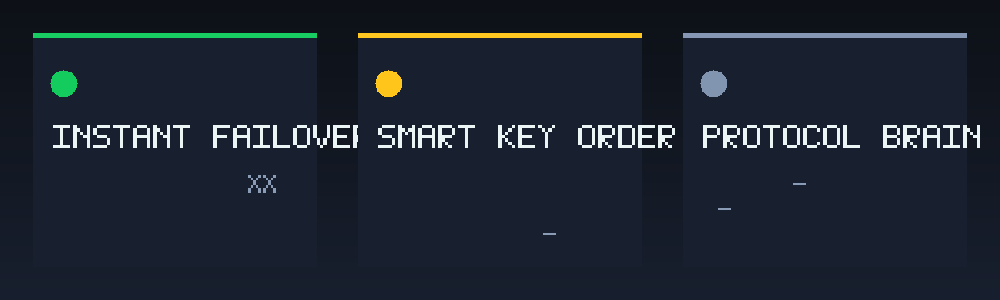
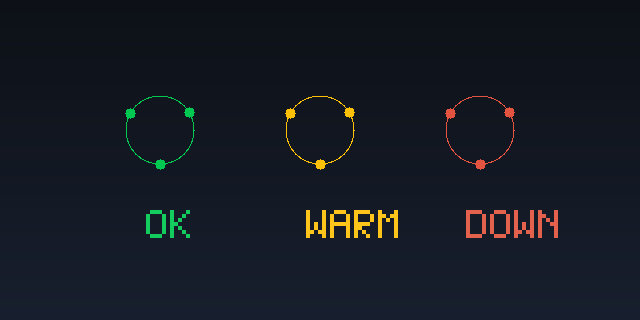

# OpenCode Go Proxy






   

Smart API key rotation proxy for OpenCode Go/Zen models with weighted scoring, immediate Zen fallback, and a single system tray icon for full management.

**Highlights (current hard build v10.1):**
- Streaming-first: client headers flush on upstream first byte; per-attempt TTFB 25s + attempt 90s + global first-byte budget 240s — long generations never trip the 300s client header wait, hung keys fail over in seconds with zero slowdown to healthy streams
- Fresh `x-opencode-session` per key attempt + full OpenCode identity: paid funds/policy rotation exhausts every key before any Zen divert, so one transient verdict can never surface `insufficient funds` / `trains on request data` while headroom exists
- Generic policy-class matcher + synthetic retryable 503 final relay: raw gateway 400/403/error-frame text never reaches a client for any model, key, or account
- Exact key-count reconcile (`KEYS_RECONCILED`): add/remove/reorder in `api.txt` joins rotation immediately with stale scores pruned; 90s funds cooldown re-scored by the 20s usage poller

## Universal Token Efficiency (2026-09-30, all models, all wires)

Client-side only — no proxy code changed. Global `opencode.json`:
`share:disabled`, `formatter:false`, `compaction{auto,prune,reserve:10000}`,
1h prompt cache on both proxy providers, composio+uitars lazy-loaded
(disabled by default, per-task enable), windows-mcp on, build steps 25,
short universal instructions with MCP directory. Env override fixed to
`muse-spark-1.3-contributor`. Verified live: CHAT_OK (deepseek-v4.1-flash),
RESPONSES_OK (muse-spark-1.3-contributor), MESSAGES_OK (qwen3.8-flash).
Estimate: ~60% fewer billed tokens (55-70% range) on every task/model.

## Quick Start (Fresh Windows)

1. Copy this folder anywhere
2. Add your API keys to `api.txt` (one per line)
3. Double-click `OpencodeGoProxy.exe`

That's it. Zero configuration needed. The proxy auto-starts at Windows logon via a scheduled task.

## Features


### Smart Key Rotation
Weighted scoring prioritizes long-lived limits:
- **Monthly (0.45)** — hardest to recover
- **Weekly (0.30)** — second priority
- **Daily / 7-day (0.15)** — mid-term window
- **Rolling 5h (0.10)** — resets fastest

Weights are normalized across the windows the upstream reports, and any
window that hits 100% immediately benches the key.




### Immediate Zen Fallback
When Go upstream fails, retry on Zen instantly:
- Insufficient funds → Zen
- Global regions policy → Zen
- Training consent required → Zen


### Single System Tray Icon
- Show Status, Reorder Keys, Open Config/Keys
- Auto health check every 2 minutes
- Key file watcher

## Architecture






## Testing

Live harness against the running proxy (health, unique model catalog, cheapest-keys
first round trip, responses wire, secret-redaction scan):

```powershell
powershell -ExecutionPolicy Bypass -File tests\verify.ps1
```

Latest run: `RESULT passes=5 failures=0`

## Files

| File | Purpose |
|------|---------|
| `OpencodeGoProxy.exe` | The proxy (self-contained, no install needed) |
| `config.json` | Configuration (defaults work out of the box) |
| `api.txt` | Your API keys (create this file, one per line) |
| `build.ps1` | Rebuild from source |

## Configuration

Edit `config.json` only if you need custom settings. Defaults:

```json
{
  "listen_prefix": "http://127.0.0.1:4001/",
  "upstream_base_url": "https://opencode.ai/zen/go/v1",
  "zen_upstream_base_url": "https://opencode.ai/zen/v1",
  "credential_source": "api.txt",
  "local_api_key": "7rPWb0YtL2miBuu2dep2Qv0kc7LNj-QpRhDIOOxLgqk",
  "public_model": "opencode-go",
  "upstream_model": "kimi-k3"
}
```

## Supported Models

30+ models via Go and Zen upstreams (deepseek-v4-flash, mimo-v2.5, kimi-k3, gpt-6-luna, grok-4.6, etc.)

## Building from Source

```powershell
.\build.ps1 -OutputPath OpencodeGoProxy.exe
```

Requires .NET Framework 4.0+ (built into Windows 10/11).

## License

MIT
