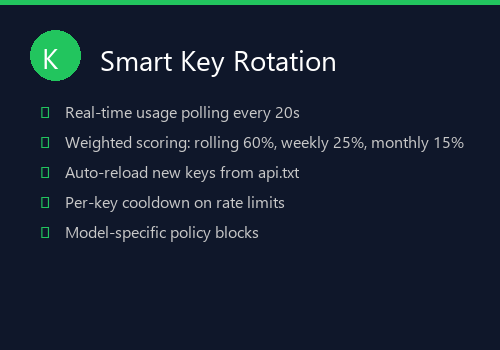
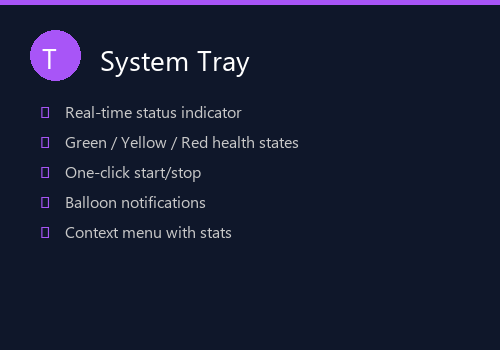
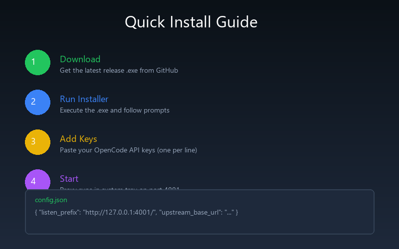

<div align="center">


# OpenCode Go Proxy

**Smart multi-key rotation proxy for the OpenCode Go API**

[](https://opensource.org/licenses/MIT)
[](https://www.microsoft.com/windows)
[](https://dotnet.microsoft.com/)
[](#)
[](#)

[Download Latest Release](https://github.com/Michaelunkai/OpencodeGoProxy/releases) · [Report Bug](https://github.com/Michaelunkai/OpencodeGoProxy/issues) · [Request Feature](https://github.com/Michaelunkai/OpencodeGoProxy/issues)

</div>

---

## What is OpenCode Go Proxy?

OpenCode Go Proxy is a **smart, self-contained Windows proxy** that sits between your AI coding tools (Codex, CLI, etc.) and the OpenCode Go API. It automatically rotates between multiple API keys to maximize your usage across rolling, weekly, and monthly limits — all while providing real-time status via a system tray icon.

<div align="center">


</div>

---

## Features

<div align="center">

|  |  |  |
|:---:|:---:|:---:|
| **Smart Key Rotation** | **Policy Failover** | **System Tray** |
| Weighted scoring across 3 time windows | Automatic detection & retry | Real-time health indicator |

</div>

### Key Rotation
- **Real-time usage polling** every 20 seconds per key
- **Weighted scoring algorithm**: Rolling (60%), Weekly (25%), Monthly (15%)
- **Auto-reload** new keys from `api.txt` — no restart needed
- **Per-key cooldown** on rate limits and errors
- **Model-specific policy blocks** remembered per key

### Policy Failover
- **Training-data rejection** detection and automatic retry
- **Global regions requirement** handling
- **Zen fallback endpoint** when all Go keys are exhausted
- **Model remapping** for free-tier variants
- **Zero-downtime** key switching

### System Tray
- **Green / Yellow / Red** health states at a glance
- **Balloon notifications** for key exhaustion
- **Context menu** with live stats
- **One-click start/stop**

---

## Quick Start

<div align="center">



</div>

### Option 1: Installer (Recommended)

1. Download `OpencodeGoProxy-Setup.exe` from the [Releases](https://github.com/Michaelunkai/OpencodeGoProxy/releases) page
2. Run the installer — it sets up everything automatically
3. Add your API keys to the config file
4. Launch from the Start Menu or system tray

### Option 2: Portable

1. Download `OpencodeGoProxy-Portable.zip` from the [Releases](https://github.com/Michaelunkai/OpencodeGoProxy/releases) page
2. Extract to any folder
3. Run `OpencodeGoProxy.exe`
4. Add your API keys to `api.txt`

### Adding API Keys

Add one key per line to your key file:

```
oc_sk_your_first_key_here
oc_sk_your_second_key_here
oc_sk_your_third_key_here
```

> **Note:** New keys are detected automatically — no restart required!

---

## Configuration

The proxy is configured via `config.json`:

```json
{
  "listen_prefix": "http://127.0.0.1:4001/",
  "upstream_base_url": "https://opencode.ai/zen/go/v1",
  "zen_upstream_base_url": "https://opencode.ai/zen/v1",
  "credential_source": "F:\\backup\\windowsapps\\credentials\\opencodego\\api.txt",
  "zen_credential_source": "F:\\backup\\windowsapps\\credentials\\opencodego\\api.txt",
  "local_api_key": "7rPWb0YtL2miBuu2dep2Qv0kc7LNj-QpRhDIOOxLgqk",
  "public_model": "opencode-go",
  "upstream_model": "kimi-k3",
  "retry_server_error_from": 500,
  "retry_http_statuses": [401, 402, 403, 408, 425, 429]
}
```

| Setting | Default | Description |
|---------|---------|-------------|
| `listen_prefix` | `http://127.0.0.1:4001/` | Proxy listen address and port |
| `upstream_base_url` | `https://opencode.ai/zen/go/v1` | Primary Go subscription upstream |
| `zen_upstream_base_url` | `https://opencode.ai/zen/v1` | Zen pay-as-you-go fallback |
| `credential_source` | *(path to api.txt)* | File containing API keys (one per line) |
| `local_api_key` | *(random)* | Bearer key clients must use to connect |
| `retry_http_statuses` | 401,402,403,408,425,429 | HTTP status codes that trigger key failover |

---

## How It Works

```
┌─────────────┐     ┌──────────────────┐     ┌─────────────────┐
│  Codex /    │────▶│  OpenCode Go     │────▶│  Key Pool       │
│  CLI        │     │  Proxy           │     │  (3+ keys)      │
│  Client     │     │  (Port 4001)     │     │                 │
└─────────────┘     └──────────────────┘     └────────┬────────┘
                                                       │
                              ┌────────────────────────┼────────────────────────┐
                              │                        │                        │
                              ▼                        ▼                        ▼
                        ┌──────────┐            ┌──────────┐            ┌──────────┐
                        │  Key 1   │            │  Key 2   │            │  Key 3   │
                        │  score=45│            │  score=0 │            │  score=99│
                        └────┬─────┘            └────┬─────┘            └────┬─────┘
                             │                       │                       │
                             ▼                       ▼                       ▼
                        ┌──────────────────────────────────────────────────────────┐
                        │              OpenCode Go API (opencode.ai)               │
                        └──────────────────────────────────────────────────────────┘
```

### Scoring Algorithm

Each key is scored every 20 seconds based on its usage across three time windows:

```
score = 100 - max(rolling%, weekly%, monthly%)
```

The key with the **highest score** (most headroom) is always tried first. When a key hits 100% on any window, it's automatically skipped.

---

## Building from Source

### Prerequisites
- Windows 7 or later
- .NET Framework 4.0 or later
- PowerShell 5.0 or later

### Build Steps

```powershell
# Clone the repository
git clone https://github.com/Michaelunkai/OpencodeGoProxy.git
cd OpencodeGoProxy

# Build the proxy
.\build.ps1

# Run the proxy
.\start_proxy.ps1
```

---

## Supported Models

The proxy supports **30+ models** including:

| Category | Models |
|----------|--------|
| **DeepSeek** | deepseek-v4-flash, deepseek-v4-pro, deepseek-v4.1-flash |
| **MIMO** | mimo-v2.5, mimo-v2.5-pro, mimo-v2.6-flash, mimo-v2.6-pro |
| **Kimi** | kimi-k3, kimi-k2.7-code, kimi-k2.6 |
| **Qwen** | qwen3.8-max, qwen3.8-flash, qwen3.7-plus, qwen3.6-plus |
| **GLM** | glm-5.3, glm-5.2 |
| **Minimax** | minimax-m3, minimax-m2.7 |
| **Muse Spark** | muse-spark-1.3-contributor, muse-spark-1.2-contributor |
| **GPT** | gpt-5.6-luna, gpt-6-luna |
| **Grok** | grok-4.6, grok-4.7 |
| **Free Tier** | big-pickle, jev-1.13-free, muse-spark-free |

---

## Troubleshooting

| Issue | Solution |
|-------|----------|
| Port 4001 already in use | Change `listen_prefix` in config.json |
| All keys rate-limited | Add more keys to api.txt or wait for reset |
| "Global regions" error | Enable Global regions in OpenCode workspace settings |
| "Trains on request data" error | Enable privacy consent in OpenCode workspace settings |
| Tray icon not showing | Restart the proxy or check Windows notification settings |

---

## License

This project is licensed under the MIT License — see the [LICENSE](LICENSE) file for details.

---

<div align="center">

**[Download Latest Release](https://github.com/Michaelunkai/OpencodeGoProxy/releases)** · [GitHub Repository](https://github.com/Michaelunkai/OpencodeGoProxy)

Made with care for the OpenCode community

</div>
